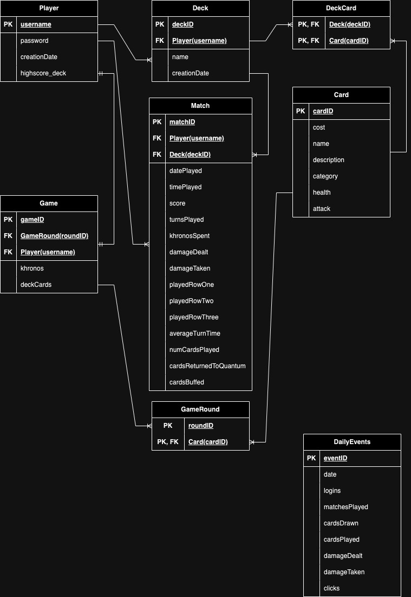

# Database Modeling Exercise - Chronicle Doom

## Entity Relationship Diagram Model

## Entities
### - Player: 
Stores information about each player registered in the game.
### - Card: 
Stores information about the individual cards available in the game.
### - Deck: 
Stores information about the decks created by players.
### - Match: 
Stores the outcome of a full match after a player has finished playing.
### - GameRound: 
Stores information about each round of the game.
### - Game: 
Stores the state of the game for each player.
### - DeckCard: 
Maps the relationship between decks and cards.

## Relationships
- Player - Deck

One Player can own multiple Decks.

A Deck is owned by one Player.

- Deck - Card (via DeckCard)

One Deck contains multiple Cards.

One Card can be in multiple Decks.

- Player - Match

One Player can play multiple Matches.

A Match involves one Player.

- Deck - Match

One Deck can be used in multiple Matches.

A Match uses only one Deck.

- Card - GameRound

One Card can appear in multiple GameRounds.

- Player - Game

One Player can have multiple Games.

A Game is associated with one Player.

- GameRound - Game

One GameRound can be part of multiple Games.

## Normalization
The database schema is normalized to Third Normal Form (3NF):

### - First Normal Form (1NF)

All columns contain atomic values.
Each table has a primary key.

### - Second Normal Form (2NF)

All non-key attributes are fully functionally dependent on the primary key.

### - Third Normal Form (3NF)

All attributes are functionally dependent only on the primary key (no transitive dependencies).