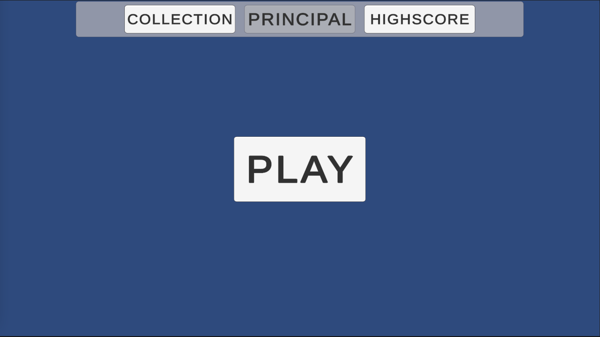
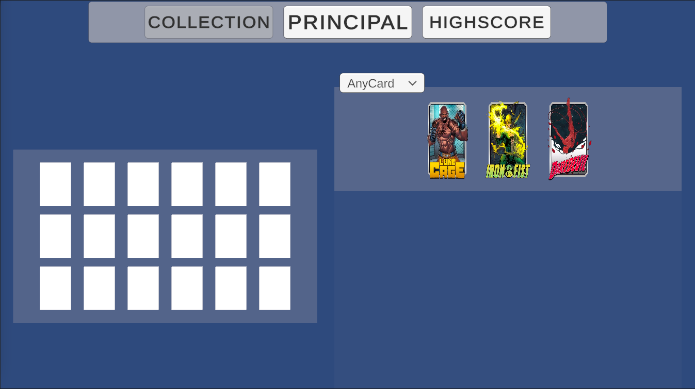
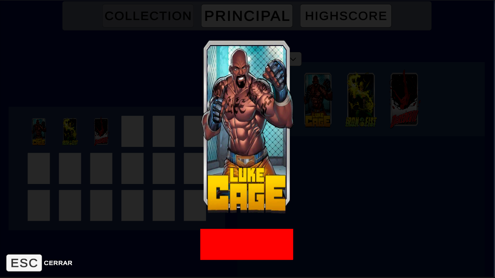
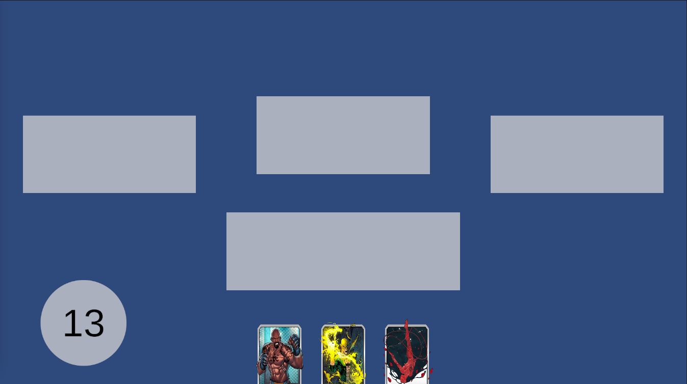

# **Chronical Doom**

## _Game Design Document_

---

##### **Copyright notice / author information / boring legal stuff nobody likes**

##
## _Index_

---

1. [Index](#index)
2. [Game Design](#game-design)
    1. [Summary](#summary)
    2. [Gameplay](#gameplay)
    3. [Mindset](#mindset)
3. [Technical](#technical)
    1. [Screens](#screens)
    2. [Controls](#controls)
    3. [Mechanics](#mechanics)
4. [Level Design](#level-design)
    1. [Themes](#themes)
        1. Ambience
        2. Objects
            1. Ambient
            2. Interactive
        3. Challenges
    2. [Game Flow](#game-flow)
5. [Development](#development)
    1. [Abstract Classes](#abstract-classes--components)
    2. [Derived Classes](#derived-classes--component-compositions)
6. [Graphics](#graphics)
    1. [Style Attributes](#style-attributes)
    2. [Graphics Needed](#graphics-needed)
7. [Sounds/Music](#soundsmusic)
    1. [Style Attributes](#style-attributes-1)
    2. [Sounds Needed](#sounds-needed)
    3. [Music Needed](#music-needed)
8. [Schedule](#schedule)

## _Game Design_

---

### **Terminology**

- **Khronos:** Resource used by the player to play cards and perform actions during their turn.

- **Quantum-Tunnel:** Intermediate space manipulated by the player, allowing them to strategically deploy units and spells onto the battlefield.

- **Paradox Cards:** Special abilities that players can utilize to influence the battlefield, providing tactical advantages or disrupting enemy strategies.

- **Time-Lines:** Three diferent divisions on the battlefield where the player can position their units to block enemy attacks and engage in combat. Only a maximum of 3 cards per side are allowed on each timeline.

- **Nexus Nodes:** Score made all along the game.

### **Summary**

The game is a turn-based strategy deck-building experience, drawing inspiration from strategic elements in gaming. Players expend __Khronos__ to play cards each turn, strategically deploying them on __Time-Lines__ after passing through a __Quantum-Tunnel__, an intermediate space manipulated by the player. As waves of attacks from the CPU assail the player each round, they must use their resources judiciously to survive.

### **Gameplay**

The gameplay is turn based, where the player expends their resources to react to the attack waves prepared by the CPU. At the start of each round, the player is shown the template of enemies that will appear that round. The player has a turn to prepare, in which it can play unit cards on the board or play __Paradox cards__. The CPU then prepares a set of enemies to create the first wave of attack aligning them in the battlefield and it's then the player's turn. The player decides how to block the attack by positioning their units on the board at the battlefield in one of the three __Time-Lines__ available.

The units on the battlefield engage in 1-on-1 combat based on their positioning, and surviving cards remain on their battle positions. The player can choose to reposition their units on the board to adjacent battle positions or retreat from the battlefield, still on the board. The CPU doesn't reposition their troops, but insteead prepares more units as reinforcements for the next wave. 
Additionally, units remaining in the __Quantum-Tunnel__ can activate upgraders or passive abilities that benefit the player's progression in terms of statistics or advantageous effects. The combination of cards across the entire battlefield is crucial for varying the outcome of each match and maximizing strategic possibilities.

There can be a maximum of 3 units per side on each __Time-Line__ in the battlefield, it means 9 cards distributed across the three timelines, and 5 more units in the __Quantum-Tunnel__

The player must make use of their available __Khronos__ to position their units and use __Paradox cards__ to defeat each wave and survive the round. Formations and unit rotations are crucial to maintain all __Time-Lines__.

The player's available __Khronos__ gradually increases as the rounds progress, allowing them to opt for more complex and interesting strategies. With additional __Khronos__, the player can deploy more powerful units, cast more devastating spells, or execute more elaborate tactical maneuvers to counter enemy waves. This mechanic provides dynamic progression and strategic challenges in each round, encouraging the player to adapt their tactics as the difficulty ramps up.

### **Mindset**

The player will feel overwhelmed by the attrition the constant waves imply for their limited amount of resources. They should be nervous and this will be achieved by making their units frail and outnumbered by the enemies, which will be a challenging experience for them to solve.
We could consider adding different progression elements such as unlocking new cards or abilities to maintain long-term engagement and reward player progress.

## _Technical_

---

### **Screens**

1. MainMenu Screen
    
    1. Collection Deck
        
        
    2. Highscore
    3. Options&Settings
2. Game Screen
    1. Wave Change
    2. During the Wave
        
3. End Credits

### **Controls**

**Mouse Controls:**
- Left Click: Select cards, activate buttons, or interact with UI elements. To move cards, click and drag them to the desired position on the battlefield.
- Right Click: View cards in detail, including statistics and special abilities, by right-clicking on them.

### **Mechanics**

1. **Quantum-Tunnel Manipulation:**
* Implementation: Utilize algorithms to simulate the Quantum-Tunnel's manipulation mechanics. This involves allowing players to move and position units and spells across different timelines on the battlefield.

2. **Unit Positioning and Combat:**
* Implementation: Implement algorithms to determine unit positioning and combat outcomes based on unit stats and positioning on the battlefield. This involves calculating attack and defense values, as well as resolving combat interactions between units.

3. **Card Deployment and Spell Casting:**
* Implementation: Develop a system that allows players to deploy cards onto the battlefield by clicking and dragging them to the desired position. For spell casting, implement a similar system where players can activate Paradox Cards by selecting them from their hand and targeting the desired location or unit on the battlefield.

4. **Resource Management:**
* Implementation: Create a resource management system that tracks players' Khronos and ensures that they have enough resources to deploy cards and activate spells each turn. This involves implementing algorithms to calculate resource generation and expenditure based on player actions and game state.

### **List of Assets**

1. **Graphic Assets:**
    - Character Sprites: All character and enemy sprites will have the same card format, which will consist of custom cards drawn by us with character differentiation.
    - Frame design: All cards will have a frame to differentiate between enemy cards and our own cards, which will also be drawn by us.
        - Unit design: contains cost, name, health, attack and description.
        - Paradox design: contains cost, name and description.
    - Animations: Animation sequences for movements, attacks, special effects, etc.
        - Playing card: when cards are played from the player's hand, the way they are integrated into the board.
        - Card battle: when cards are in combat, the way they clash and affect one another.
        - Card death: when a unit is killed, how it is removed from the board.
        - Paradox usage: when a paradox card is used, to signify its effect.
    - Background Images: Instead of tilesets, we will use background images that might have slight movement animations to enhance the environment.
    - UI and HUD: User Interface elements, including buttons, health bars, menus, etc.
        - Khronos meter: graphic to show how much Khronos the player has.
        - Deck Cards: graphic to show the remaining number of cards in the player's deck.
        - Player life: graphic to show the player remaining health points
        - Wave counter: graphic to show what wave number the player is currently in.
    - Icons and Menus: Specific designs for skill icons, pause menus, and other navigation screens.
        - End turn button: button for ending player turn.
        - Main menu: player can choose to customize deck or play with existing deck.
        - Deck building menu: player can choose cards to add or remove from his deck from his collection.
        - Highscore: player can see his high score and the deck they got it with.
2. **Sound Assets**
    - Sound Effects: Sounds for actions like hits, healing, explosions, item collection, card drawin etc.
        - Card clash: when cards clash in a time-line.
        - Wave start: right as the wave is about to begin.
        - Card death: when a unit card is eliminated.
        - Khronos refill: when the player gains more khronos.
        - Unit card played: when a unit card is played from the player's hand.
        - Paradox card played: when a paradox card is played from the player's hand.
        - Unit movement: when a unit is redeployed from time-line to time-line and the quantum tunnel.
    - Background Music: Music tracks for the game and menus.
        - Menu music: music before the game starts.
        - Gameplay music: music while the game is going on.
3. **Script**
    - Game Scripts: Code that controls game mechanics, such as card movements, combat interactions, and UI logic.
        - GameController: in charge of game logic and management.
        - PlayerHand: in charge of player hand management.
        - UnitCard: in charge of unit card interaction, playing, deployment and death.
        - TimeLine: in charge of timeline clashes and units.
        - QuantumTunnel: in charge of quantum tunnel units.
        - Wave: in charge of wave behavior.

## _Level Design_

---

### **Themes**

1. *Place Name*
    1. Mood
        1. *Mood*
    2. Objects
        1. _Ambient_
            1. *Ambient*
        2. _Interactive_
            1. *Interactive*

_(example)_

### **Game Flow**

## _Development_

---

### **Abstract Classes / Components**

1. BaseCard
2. BasePlayer
3. BaseWave
4. BaseCardPlace

### **Derived Classes / Component Compositions**

1. BasePlayer
    1. PlayerMain
2. BaseCard
    1. UnitCard
    2. ParadoxCard
3. BaseCardPlace
    1. CardPlaceHand
    2. CardPlaceQTunnel
    3. CardPlaceTimeLine

## _Graphics_

---

### **Style Attributes**

What kinds of colors will you be using? Do you have a limited palette to work with? A post-processed HSV map/image? Consistency is key for immersion.

What kind of graphic style are you going for? Cartoony? Pixel-y? Cute? How, specifically? Solid, thick outlines with flat hues? Non-black outlines with limited tints/shades? Emphasize smooth curvatures over sharp angles? Describe a set of general rules depicting your style here.

Well-designed feedback, both good (e.g. leveling up) and bad (e.g. being hit), are great for teaching the player how to play through trial and error, instead of scripting a lengthy tutorial. What kind of visual feedback are you going to use to let the player know they&#39;re interacting with something? That they \*can\* interact with something?

### **Graphics Needed**

1. Characters
    1. Human-like
        1. Goblin (idle, walking, throwing)
        2. Guard (idle, walking, stabbing)
        3. Prisoner (walking, running)
    2. Other
        1. Wolf (idle, walking, running)
        2. Giant Rat (idle, scurrying)
2. Blocks
    1. Dirt
    2. Dirt/Grass
    3. Stone Block
    4. Stone Bricks
    5. Tiled Floor
    6. Weathered Stone Block
    7. Weathered Stone Bricks
3. Ambient
    1. Tall Grass
    2. Rodent (idle, scurrying)
    3. Torch
    4. Armored Suit
    5. Chains (matching Weathered Stone Bricks)
    6. Blood stains (matching Weathered Stone Bricks)
4. Other
    1. Chest
    2. Door (matching Stone Bricks)
    3. Gate
    4. Button (matching Weathered Stone Bricks)

_(example)_

## _Sounds/Music_

---

### **Style Attributes**

Again, consistency is key. Define that consistency here. What kind of instruments do you want to use in your music? Any particular tempo, key? Influences, genre? Mood?

Stylistically, what kind of sound effects are you looking for? Do you want to exaggerate actions with lengthy, cartoony sounds (e.g. mario&#39;s jump), or use just enough to let the player know something happened (e.g. mega man&#39;s landing)? Going for realism? You can use the music style as a bit of a reference too.

 Remember, auditory feedback should stand out from the music and other sound effects so the player hears it well. Volume, panning, and frequency/pitch are all important aspects to consider in both music _and_ sounds - so plan accordingly!

### **Sounds Needed**

1. Effects
    1. Soft Footsteps (dirt floor)
    2. Sharper Footsteps (stone floor)
    3. Soft Landing (low vertical velocity)
    4. Hard Landing (high vertical velocity)
    5. Glass Breaking
    6. Chest Opening
    7. Door Opening
2. Feedback
    1. Relieved &quot;Ahhhh!&quot; (health)
    2. Shocked &quot;Ooomph!&quot; (attacked)
    3. Happy chime (extra life)
    4. Sad chime (died)

_(example)_

### **Music Needed**

1. Slow-paced, nerve-racking &quot;forest&quot; track
2. Exciting &quot;castle&quot; track
3. Creepy, slow &quot;dungeon&quot; track
4. Happy ending credits track
5. Rick Astley&#39;s hit #1 single &quot;Never Gonna Give You Up&quot;

_(example)_

## _Schedule_

---

_(define the main activities and the expected dates when they should be finished. This is only a reference, and can change as the project is developed)_

1. develop base classes
    1. base entity
        1. base player
        2. base enemy
        3. base block
  2. base app state
        1. game world
        2. menu world
2. develop player and basic block classes
    1. physics / collisions
3. find some smooth controls/physics
4. develop other derived classes
    1. blocks
        1. moving
        2. falling
        3. breaking
        4. cloud
    2. enemies
        1. soldier
        2. rat
        3. etc.
5. design levels
    1. introduce motion/jumping
    2. introduce throwing
    3. mind the pacing, let the player play between lessons
6. design sounds
7. design music

_(example)_
